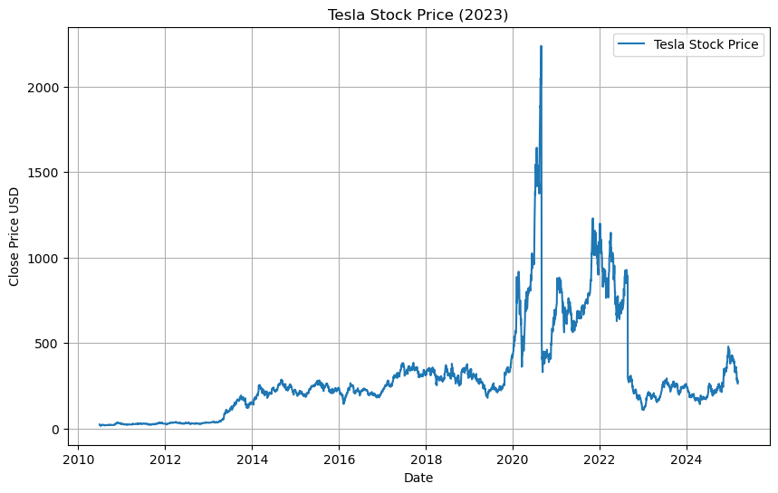
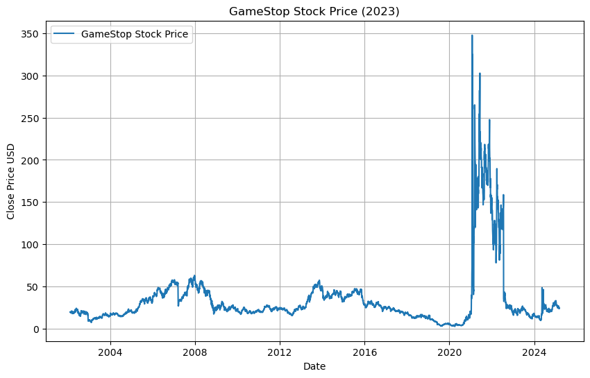

```python
import yfinance as yf
import pandas as pd
import matplotlib.pyplot as plt

```


```python
!pip install alpha_vantage
```

    Requirement already satisfied: alpha_vantage in c:\users\zisha\anaconda3\lib\site-packages (3.0.0)
    Requirement already satisfied: aiohttp in c:\users\zisha\anaconda3\lib\site-packages (from alpha_vantage) (3.10.5)
    Requirement already satisfied: requests in c:\users\zisha\anaconda3\lib\site-packages (from alpha_vantage) (2.32.3)
    Requirement already satisfied: aiohappyeyeballs>=2.3.0 in c:\users\zisha\anaconda3\lib\site-packages (from aiohttp->alpha_vantage) (2.4.0)
    Requirement already satisfied: aiosignal>=1.1.2 in c:\users\zisha\anaconda3\lib\site-packages (from aiohttp->alpha_vantage) (1.2.0)
    Requirement already satisfied: attrs>=17.3.0 in c:\users\zisha\anaconda3\lib\site-packages (from aiohttp->alpha_vantage) (23.1.0)
    Requirement already satisfied: frozenlist>=1.1.1 in c:\users\zisha\anaconda3\lib\site-packages (from aiohttp->alpha_vantage) (1.4.0)
    Requirement already satisfied: multidict<7.0,>=4.5 in c:\users\zisha\anaconda3\lib\site-packages (from aiohttp->alpha_vantage) (6.0.4)
    Requirement already satisfied: yarl<2.0,>=1.0 in c:\users\zisha\anaconda3\lib\site-packages (from aiohttp->alpha_vantage) (1.11.0)
    Requirement already satisfied: charset-normalizer<4,>=2 in c:\users\zisha\anaconda3\lib\site-packages (from requests->alpha_vantage) (3.3.2)
    Requirement already satisfied: idna<4,>=2.5 in c:\users\zisha\anaconda3\lib\site-packages (from requests->alpha_vantage) (3.7)
    Requirement already satisfied: urllib3<3,>=1.21.1 in c:\users\zisha\anaconda3\lib\site-packages (from requests->alpha_vantage) (2.2.3)
    Requirement already satisfied: certifi>=2017.4.17 in c:\users\zisha\anaconda3\lib\site-packages (from requests->alpha_vantage) (2024.12.14)
    


```python
from alpha_vantage.timeseries import TimeSeries
import pandas as pd

# Your API key
api_key = 'T507ONP6F6I2Q6IX'

# Create a TimeSeries object
ts = TimeSeries(key=api_key, output_format='pandas')

# Extract Tesla stock data
tesla_data, meta_data = ts.get_daily(symbol='TSLA', outputsize='full')

# Reset the index
tesla_data.reset_index(inplace=True)

# Display the first five rows
tesla_data.head()

```


<div>
<style scoped>
    .dataframe tbody tr th:only-of-type {
        vertical-align: middle;
    }

    .dataframe tbody tr th {
        vertical-align: top;
    }

    .dataframe thead th {
        text-align: right;
    }
</style>
<table border="1" class="dataframe">
  <thead>
    <tr style="text-align: right;">
      <th></th>
      <th>date</th>
      <th>1. open</th>
      <th>2. high</th>
      <th>3. low</th>
      <th>4. close</th>
      <th>5. volume</th>
    </tr>
  </thead>
  <tbody>
    <tr>
      <th>0</th>
      <td>2025-03-06</td>
      <td>272.06</td>
      <td>272.65</td>
      <td>260.0200</td>
      <td>263.45</td>
      <td>98451566.0</td>
    </tr>
    <tr>
      <th>1</th>
      <td>2025-03-05</td>
      <td>272.92</td>
      <td>279.55</td>
      <td>267.7100</td>
      <td>279.10</td>
      <td>94042913.0</td>
    </tr>
    <tr>
      <th>2</th>
      <td>2025-03-04</td>
      <td>270.93</td>
      <td>284.35</td>
      <td>261.8401</td>
      <td>272.04</td>
      <td>126706623.0</td>
    </tr>
    <tr>
      <th>3</th>
      <td>2025-03-03</td>
      <td>300.34</td>
      <td>303.94</td>
      <td>277.3000</td>
      <td>284.65</td>
      <td>115551414.0</td>
    </tr>
    <tr>
      <th>4</th>
      <td>2025-02-28</td>
      <td>279.50</td>
      <td>293.88</td>
      <td>273.6000</td>
      <td>292.98</td>
      <td>115696968.0</td>
    </tr>
  </tbody>
</table>
</div>


```python
!pip install requests
!pip install beautifulsoup4

```

    Requirement already satisfied: requests in c:\users\zisha\anaconda3\lib\site-packages (2.32.3)
    Requirement already satisfied: charset-normalizer<4,>=2 in c:\users\zisha\anaconda3\lib\site-packages (from requests) (3.3.2)
    Requirement already satisfied: idna<4,>=2.5 in c:\users\zisha\anaconda3\lib\site-packages (from requests) (3.7)
    Requirement already satisfied: urllib3<3,>=1.21.1 in c:\users\zisha\anaconda3\lib\site-packages (from requests) (2.2.3)
    Requirement already satisfied: certifi>=2017.4.17 in c:\users\zisha\anaconda3\lib\site-packages (from requests) (2024.12.14)
    Requirement already satisfied: beautifulsoup4 in c:\users\zisha\anaconda3\lib\site-packages (4.12.3)
    Requirement already satisfied: soupsieve>1.2 in c:\users\zisha\anaconda3\lib\site-packages (from beautifulsoup4) (2.5)
    


```python
!pip install requests
!pip install beautifulsoup4

```

    Requirement already satisfied: requests in c:\users\zisha\anaconda3\lib\site-packages (2.32.3)
    Requirement already satisfied: charset-normalizer<4,>=2 in c:\users\zisha\anaconda3\lib\site-packages (from requests) (3.3.2)
    Requirement already satisfied: idna<4,>=2.5 in c:\users\zisha\anaconda3\lib\site-packages (from requests) (3.7)
    Requirement already satisfied: urllib3<3,>=1.21.1 in c:\users\zisha\anaconda3\lib\site-packages (from requests) (2.2.3)
    Requirement already satisfied: certifi>=2017.4.17 in c:\users\zisha\anaconda3\lib\site-packages (from requests) (2024.12.14)
    Requirement already satisfied: beautifulsoup4 in c:\users\zisha\anaconda3\lib\site-packages (4.12.3)
    Requirement already satisfied: soupsieve>1.2 in c:\users\zisha\anaconda3\lib\site-packages (from beautifulsoup4) (2.5)
    


```python
!pip install pandas_datareader

```

    Requirement already satisfied: pandas_datareader in c:\users\zisha\anaconda3\lib\site-packages (0.10.0)
    Requirement already satisfied: lxml in c:\users\zisha\anaconda3\lib\site-packages (from pandas_datareader) (4.9.4)
    Requirement already satisfied: pandas>=0.23 in c:\users\zisha\anaconda3\lib\site-packages (from pandas_datareader) (2.2.2)
    Requirement already satisfied: requests>=2.19.0 in c:\users\zisha\anaconda3\lib\site-packages (from pandas_datareader) (2.32.3)
    Requirement already satisfied: numpy>=1.26.0 in c:\users\zisha\anaconda3\lib\site-packages (from pandas>=0.23->pandas_datareader) (1.26.4)
    Requirement already satisfied: python-dateutil>=2.8.2 in c:\users\zisha\anaconda3\lib\site-packages (from pandas>=0.23->pandas_datareader) (2.9.0.post0)
    Requirement already satisfied: pytz>=2020.1 in c:\users\zisha\anaconda3\lib\site-packages (from pandas>=0.23->pandas_datareader) (2024.1)
    Requirement already satisfied: tzdata>=2022.7 in c:\users\zisha\anaconda3\lib\site-packages (from pandas>=0.23->pandas_datareader) (2023.3)
    Requirement already satisfied: charset-normalizer<4,>=2 in c:\users\zisha\anaconda3\lib\site-packages (from requests>=2.19.0->pandas_datareader) (3.3.2)
    Requirement already satisfied: idna<4,>=2.5 in c:\users\zisha\anaconda3\lib\site-packages (from requests>=2.19.0->pandas_datareader) (3.7)
    Requirement already satisfied: urllib3<3,>=1.21.1 in c:\users\zisha\anaconda3\lib\site-packages (from requests>=2.19.0->pandas_datareader) (2.2.3)
    Requirement already satisfied: certifi>=2017.4.17 in c:\users\zisha\anaconda3\lib\site-packages (from requests>=2.19.0->pandas_datareader) (2024.12.14)
    Requirement already satisfied: six>=1.5 in c:\users\zisha\anaconda3\lib\site-packages (from python-dateutil>=2.8.2->pandas>=0.23->pandas_datareader) (1.16.0)
    


```python
import pandas_datareader as pdr
import datetime

# Define the time period
start_date = datetime.datetime(2023, 1, 1)
end_date = datetime.datetime(2023, 12, 31)

# Fetch Tesla stock data
tesla_data = pdr.get_data_yahoo('TSLA', start=start_date, end=end_date)

# Display the last five rows
tesla_data.tail()

```


```python
!pip install requests
!pip install beautifulsoup4

```


```python
import requests
from bs4 import BeautifulSoup
import pandas as pd

# URL of the webpage containing Tesla's revenue data
url = 'https://www.investopedia.com/articles/investing/081316/how-tesla-makes-its-money.asp'

# Send a GET request to the webpage
response = requests.get(url)

# Parse the webpage content
soup = BeautifulSoup(response.content, 'html.parser')

# Find the table containing the revenue data by identifying it through its attributes
table = soup.find('table')

# Extract the table rows
rows = table.find_all('tr')

# Extract the data from the table rows
data = []
for row in rows[1:]:
    cols = row.find_all('td')
    cols = [col.text.strip() for col in cols]
    data.append(cols)

# Create a DataFrame from the extracted data
tesla_revenue = pd.DataFrame(data, columns=['Date', 'Revenue'])

# Display the last five rows
tesla_revenue.tail()

```


```python
!pip install yahooquery

```

    Requirement already satisfied: yahooquery in c:\users\zisha\anaconda3\lib\site-packages (2.3.7)
    Requirement already satisfied: beautifulsoup4<5.0.0,>=4.12.2 in c:\users\zisha\anaconda3\lib\site-packages (from yahooquery) (4.12.3)
    Requirement already satisfied: lxml<5.0.0,>=4.9.3 in c:\users\zisha\anaconda3\lib\site-packages (from yahooquery) (4.9.4)
    Requirement already satisfied: pandas<3.0.0,>=2.0.3 in c:\users\zisha\anaconda3\lib\site-packages (from yahooquery) (2.2.2)
    Requirement already satisfied: requests<3.0.0,>=2.31.0 in c:\users\zisha\anaconda3\lib\site-packages (from yahooquery) (2.32.3)
    Requirement already satisfied: requests-futures<2.0.0,>=1.0.1 in c:\users\zisha\anaconda3\lib\site-packages (from yahooquery) (1.0.2)
    Requirement already satisfied: tqdm<5.0.0,>=4.65.0 in c:\users\zisha\anaconda3\lib\site-packages (from yahooquery) (4.66.5)
    Requirement already satisfied: soupsieve>1.2 in c:\users\zisha\anaconda3\lib\site-packages (from beautifulsoup4<5.0.0,>=4.12.2->yahooquery) (2.5)
    Requirement already satisfied: numpy>=1.26.0 in c:\users\zisha\anaconda3\lib\site-packages (from pandas<3.0.0,>=2.0.3->yahooquery) (1.26.4)
    Requirement already satisfied: python-dateutil>=2.8.2 in c:\users\zisha\anaconda3\lib\site-packages (from pandas<3.0.0,>=2.0.3->yahooquery) (2.9.0.post0)
    Requirement already satisfied: pytz>=2020.1 in c:\users\zisha\anaconda3\lib\site-packages (from pandas<3.0.0,>=2.0.3->yahooquery) (2024.1)
    Requirement already satisfied: tzdata>=2022.7 in c:\users\zisha\anaconda3\lib\site-packages (from pandas<3.0.0,>=2.0.3->yahooquery) (2023.3)
    Requirement already satisfied: charset-normalizer<4,>=2 in c:\users\zisha\anaconda3\lib\site-packages (from requests<3.0.0,>=2.31.0->yahooquery) (3.3.2)
    Requirement already satisfied: idna<4,>=2.5 in c:\users\zisha\anaconda3\lib\site-packages (from requests<3.0.0,>=2.31.0->yahooquery) (3.7)
    Requirement already satisfied: urllib3<3,>=1.21.1 in c:\users\zisha\anaconda3\lib\site-packages (from requests<3.0.0,>=2.31.0->yahooquery) (2.2.3)
    Requirement already satisfied: certifi>=2017.4.17 in c:\users\zisha\anaconda3\lib\site-packages (from requests<3.0.0,>=2.31.0->yahooquery) (2024.12.14)
    Requirement already satisfied: colorama in c:\users\zisha\anaconda3\lib\site-packages (from tqdm<5.0.0,>=4.65.0->yahooquery) (0.4.6)
    Requirement already satisfied: six>=1.5 in c:\users\zisha\anaconda3\lib\site-packages (from python-dateutil>=2.8.2->pandas<3.0.0,>=2.0.3->yahooquery) (1.16.0)
    


```python
!pip install alpha_vantage

```

    Requirement already satisfied: alpha_vantage in c:\users\zisha\anaconda3\lib\site-packages (3.0.0)
    Requirement already satisfied: aiohttp in c:\users\zisha\anaconda3\lib\site-packages (from alpha_vantage) (3.10.5)
    Requirement already satisfied: requests in c:\users\zisha\anaconda3\lib\site-packages (from alpha_vantage) (2.32.3)
    Requirement already satisfied: aiohappyeyeballs>=2.3.0 in c:\users\zisha\anaconda3\lib\site-packages (from aiohttp->alpha_vantage) (2.4.0)
    Requirement already satisfied: aiosignal>=1.1.2 in c:\users\zisha\anaconda3\lib\site-packages (from aiohttp->alpha_vantage) (1.2.0)
    Requirement already satisfied: attrs>=17.3.0 in c:\users\zisha\anaconda3\lib\site-packages (from aiohttp->alpha_vantage) (23.1.0)
    Requirement already satisfied: frozenlist>=1.1.1 in c:\users\zisha\anaconda3\lib\site-packages (from aiohttp->alpha_vantage) (1.4.0)
    Requirement already satisfied: multidict<7.0,>=4.5 in c:\users\zisha\anaconda3\lib\site-packages (from aiohttp->alpha_vantage) (6.0.4)
    Requirement already satisfied: yarl<2.0,>=1.0 in c:\users\zisha\anaconda3\lib\site-packages (from aiohttp->alpha_vantage) (1.11.0)
    Requirement already satisfied: charset-normalizer<4,>=2 in c:\users\zisha\anaconda3\lib\site-packages (from requests->alpha_vantage) (3.3.2)
    Requirement already satisfied: idna<4,>=2.5 in c:\users\zisha\anaconda3\lib\site-packages (from requests->alpha_vantage) (3.7)
    Requirement already satisfied: urllib3<3,>=1.21.1 in c:\users\zisha\anaconda3\lib\site-packages (from requests->alpha_vantage) (2.2.3)
    Requirement already satisfied: certifi>=2017.4.17 in c:\users\zisha\anaconda3\lib\site-packages (from requests->alpha_vantage) (2024.12.14)
    


```python
from alpha_vantage.fundamentaldata import FundamentalData
import pandas as pd

# Your API key
api_key = 'T507ONP6F6I2Q6IX'

# Create a FundamentalData object
fd = FundamentalData(key=api_key, output_format='pandas')

# Extract Tesla revenue data
tesla_revenue, _ = fd.get_income_statement_annual('TSLA')

# Select relevant columns for specific revenue data
tesla_revenue = tesla_revenue[['fiscalDateEnding', 'totalRevenue']]

# Rename columns for clarity
tesla_revenue.columns = ['Date', 'Revenue']

# Convert the revenue to numeric values
tesla_revenue['Revenue'] = pd.to_numeric(tesla_revenue['Revenue'], errors='coerce')

# Display the last five rows
tesla_revenue.tail()

```


<div>
<style scoped>
    .dataframe tbody tr th:only-of-type {
        vertical-align: middle;
    }

    .dataframe tbody tr th {
        vertical-align: top;
    }

    .dataframe thead th {
        text-align: right;
    }
</style>
<table border="1" class="dataframe">
  <thead>
    <tr style="text-align: right;">
      <th></th>
      <th>Date</th>
      <th>Revenue</th>
    </tr>
    <tr>
      <th>date</th>
      <th></th>
      <th></th>
    </tr>
  </thead>
  <tbody>
    <tr>
      <th>1970-01-01 00:00:00.000000009</th>
      <td>2015-12-31</td>
      <td>4046025000</td>
    </tr>
    <tr>
      <th>1970-01-01 00:00:00.000000010</th>
      <td>2014-12-31</td>
      <td>3198356000</td>
    </tr>
    <tr>
      <th>1970-01-01 00:00:00.000000011</th>
      <td>2013-12-31</td>
      <td>217070000</td>
    </tr>
    <tr>
      <th>1970-01-01 00:00:00.000000012</th>
      <td>2012-12-31</td>
      <td>413256000</td>
    </tr>
    <tr>
      <th>1970-01-01 00:00:00.000000013</th>
      <td>2011-12-31</td>
      <td>204242000</td>
    </tr>
  </tbody>
</table>
</div>


```python
from alpha_vantage.timeseries import TimeSeries
import pandas as pd

# Your API key
api_key = 'T507ONP6F6I2Q6IX'

# Create a TimeSeries object
ts = TimeSeries(key=api_key, output_format='pandas')

# Extract GameStop stock data
gme_data, meta_data = ts.get_daily(symbol='GME', outputsize='full')

# Reset the index
gme_data.reset_index(inplace=True)

# Display the first five rows
gme_data.head()

```


<div>
<style scoped>
    .dataframe tbody tr th:only-of-type {
        vertical-align: middle;
    }

    .dataframe tbody tr th {
        vertical-align: top;
    }

    .dataframe thead th {
        text-align: right;
    }
</style>
<table border="1" class="dataframe">
  <thead>
    <tr style="text-align: right;">
      <th></th>
      <th>date</th>
      <th>1. open</th>
      <th>2. high</th>
      <th>3. low</th>
      <th>4. close</th>
      <th>5. volume</th>
    </tr>
  </thead>
  <tbody>
    <tr>
      <th>0</th>
      <td>2025-03-06</td>
      <td>24.74</td>
      <td>25.0100</td>
      <td>24.05</td>
      <td>24.20</td>
      <td>3421446.0</td>
    </tr>
    <tr>
      <th>1</th>
      <td>2025-03-05</td>
      <td>24.33</td>
      <td>25.1600</td>
      <td>24.11</td>
      <td>25.07</td>
      <td>3282452.0</td>
    </tr>
    <tr>
      <th>2</th>
      <td>2025-03-04</td>
      <td>23.77</td>
      <td>24.8600</td>
      <td>23.44</td>
      <td>24.30</td>
      <td>5068726.0</td>
    </tr>
    <tr>
      <th>3</th>
      <td>2025-03-03</td>
      <td>25.26</td>
      <td>25.4800</td>
      <td>24.18</td>
      <td>24.40</td>
      <td>4290981.0</td>
    </tr>
    <tr>
      <th>4</th>
      <td>2025-02-28</td>
      <td>24.33</td>
      <td>25.0965</td>
      <td>24.20</td>
      <td>25.04</td>
      <td>4137068.0</td>
    </tr>
  </tbody>
</table>
</div>


```python
!pip install requests
!pip install beautifulsoup4

```

    Requirement already satisfied: requests in c:\users\zisha\anaconda3\lib\site-packages (2.32.3)
    Requirement already satisfied: charset-normalizer<4,>=2 in c:\users\zisha\anaconda3\lib\site-packages (from requests) (3.3.2)
    Requirement already satisfied: idna<4,>=2.5 in c:\users\zisha\anaconda3\lib\site-packages (from requests) (3.7)
    Requirement already satisfied: urllib3<3,>=1.21.1 in c:\users\zisha\anaconda3\lib\site-packages (from requests) (2.2.3)
    Requirement already satisfied: certifi>=2017.4.17 in c:\users\zisha\anaconda3\lib\site-packages (from requests) (2024.12.14)
    Requirement already satisfied: beautifulsoup4 in c:\users\zisha\anaconda3\lib\site-packages (4.12.3)
    Requirement already satisfied: soupsieve>1.2 in c:\users\zisha\anaconda3\lib\site-packages (from beautifulsoup4) (2.5)
    


```python
from alpha_vantage.fundamentaldata import FundamentalData
import pandas as pd

# Your API key
api_key = 'T507ONP6F6I2Q6IX'

# Create a FundamentalData object
fd = FundamentalData(key=api_key, output_format='pandas')

# Extract GameStop revenue data
gme_revenue, _ = fd.get_income_statement_annual('GME')

# Select relevant columns for specific revenue data
gme_revenue = gme_revenue[['fiscalDateEnding', 'totalRevenue']]

# Rename columns for clarity
gme_revenue.columns = ['Date', 'Revenue']

# Convert the revenue to numeric values
gme_revenue['Revenue'] = pd.to_numeric(gme_revenue['Revenue'], errors='coerce')

# Display the last five rows
gme_revenue.tail()

```


<div>
<style scoped>
    .dataframe tbody tr th:only-of-type {
        vertical-align: middle;
    }

    .dataframe tbody tr th {
        vertical-align: top;
    }

    .dataframe thead th {
        text-align: right;
    }
</style>
<table border="1" class="dataframe">
  <thead>
    <tr style="text-align: right;">
      <th></th>
      <th>Date</th>
      <th>Revenue</th>
    </tr>
    <tr>
      <th>date</th>
      <th></th>
      <th></th>
    </tr>
  </thead>
  <tbody>
    <tr>
      <th>1970-01-01 00:00:00.000000010</th>
      <td>2014-02-01</td>
      <td>9026800000</td>
    </tr>
    <tr>
      <th>1970-01-01 00:00:00.000000011</th>
      <td>2013-02-02</td>
      <td>8869500000</td>
    </tr>
    <tr>
      <th>1970-01-01 00:00:00.000000012</th>
      <td>2012-01-28</td>
      <td>9517900000</td>
    </tr>
    <tr>
      <th>1970-01-01 00:00:00.000000013</th>
      <td>2011-01-29</td>
      <td>9430700000</td>
    </tr>
    <tr>
      <th>1970-01-01 00:00:00.000000014</th>
      <td>2010-01-30</td>
      <td>9027320000</td>
    </tr>
  </tbody>
</table>
</div>


```python
!pip install matplotlib

```

    Requirement already satisfied: matplotlib in c:\users\zisha\anaconda3\lib\site-packages (3.9.2)
    Requirement already satisfied: contourpy>=1.0.1 in c:\users\zisha\anaconda3\lib\site-packages (from matplotlib) (1.2.0)
    Requirement already satisfied: cycler>=0.10 in c:\users\zisha\anaconda3\lib\site-packages (from matplotlib) (0.11.0)
    Requirement already satisfied: fonttools>=4.22.0 in c:\users\zisha\anaconda3\lib\site-packages (from matplotlib) (4.51.0)
    Requirement already satisfied: kiwisolver>=1.3.1 in c:\users\zisha\anaconda3\lib\site-packages (from matplotlib) (1.4.4)
    Requirement already satisfied: numpy>=1.23 in c:\users\zisha\anaconda3\lib\site-packages (from matplotlib) (1.26.4)
    Requirement already satisfied: packaging>=20.0 in c:\users\zisha\anaconda3\lib\site-packages (from matplotlib) (24.1)
    Requirement already satisfied: pillow>=8 in c:\users\zisha\anaconda3\lib\site-packages (from matplotlib) (10.4.0)
    Requirement already satisfied: pyparsing>=2.3.1 in c:\users\zisha\anaconda3\lib\site-packages (from matplotlib) (3.1.2)
    Requirement already satisfied: python-dateutil>=2.7 in c:\users\zisha\anaconda3\lib\site-packages (from matplotlib) (2.9.0.post0)
    Requirement already satisfied: six>=1.5 in c:\users\zisha\anaconda3\lib\site-packages (from python-dateutil>=2.7->matplotlib) (1.16.0)
    


```python
!pip install alpha_vantage
!pip install matplotlib

```

    Requirement already satisfied: alpha_vantage in c:\users\zisha\anaconda3\lib\site-packages (3.0.0)
    Requirement already satisfied: aiohttp in c:\users\zisha\anaconda3\lib\site-packages (from alpha_vantage) (3.10.5)
    Requirement already satisfied: requests in c:\users\zisha\anaconda3\lib\site-packages (from alpha_vantage) (2.32.3)
    Requirement already satisfied: aiohappyeyeballs>=2.3.0 in c:\users\zisha\anaconda3\lib\site-packages (from aiohttp->alpha_vantage) (2.4.0)
    Requirement already satisfied: aiosignal>=1.1.2 in c:\users\zisha\anaconda3\lib\site-packages (from aiohttp->alpha_vantage) (1.2.0)
    Requirement already satisfied: attrs>=17.3.0 in c:\users\zisha\anaconda3\lib\site-packages (from aiohttp->alpha_vantage) (23.1.0)
    Requirement already satisfied: frozenlist>=1.1.1 in c:\users\zisha\anaconda3\lib\site-packages (from aiohttp->alpha_vantage) (1.4.0)
    Requirement already satisfied: multidict<7.0,>=4.5 in c:\users\zisha\anaconda3\lib\site-packages (from aiohttp->alpha_vantage) (6.0.4)
    Requirement already satisfied: yarl<2.0,>=1.0 in c:\users\zisha\anaconda3\lib\site-packages (from aiohttp->alpha_vantage) (1.11.0)
    Requirement already satisfied: charset-normalizer<4,>=2 in c:\users\zisha\anaconda3\lib\site-packages (from requests->alpha_vantage) (3.3.2)
    Requirement already satisfied: idna<4,>=2.5 in c:\users\zisha\anaconda3\lib\site-packages (from requests->alpha_vantage) (3.7)
    Requirement already satisfied: urllib3<3,>=1.21.1 in c:\users\zisha\anaconda3\lib\site-packages (from requests->alpha_vantage) (2.2.3)
    Requirement already satisfied: certifi>=2017.4.17 in c:\users\zisha\anaconda3\lib\site-packages (from requests->alpha_vantage) (2024.12.14)
    Requirement already satisfied: matplotlib in c:\users\zisha\anaconda3\lib\site-packages (3.9.2)
    Requirement already satisfied: contourpy>=1.0.1 in c:\users\zisha\anaconda3\lib\site-packages (from matplotlib) (1.2.0)
    Requirement already satisfied: cycler>=0.10 in c:\users\zisha\anaconda3\lib\site-packages (from matplotlib) (0.11.0)
    Requirement already satisfied: fonttools>=4.22.0 in c:\users\zisha\anaconda3\lib\site-packages (from matplotlib) (4.51.0)
    Requirement already satisfied: kiwisolver>=1.3.1 in c:\users\zisha\anaconda3\lib\site-packages (from matplotlib) (1.4.4)
    Requirement already satisfied: numpy>=1.23 in c:\users\zisha\anaconda3\lib\site-packages (from matplotlib) (1.26.4)
    Requirement already satisfied: packaging>=20.0 in c:\users\zisha\anaconda3\lib\site-packages (from matplotlib) (24.1)
    Requirement already satisfied: pillow>=8 in c:\users\zisha\anaconda3\lib\site-packages (from matplotlib) (10.4.0)
    Requirement already satisfied: pyparsing>=2.3.1 in c:\users\zisha\anaconda3\lib\site-packages (from matplotlib) (3.1.2)
    Requirement already satisfied: python-dateutil>=2.7 in c:\users\zisha\anaconda3\lib\site-packages (from matplotlib) (2.9.0.post0)
    Requirement already satisfied: six>=1.5 in c:\users\zisha\anaconda3\lib\site-packages (from python-dateutil>=2.7->matplotlib) (1.16.0)
    


```python
!pip install alpha_vantage
!pip install matplotlib

```


```python
from alpha_vantage.timeseries import TimeSeries
import pandas as pd
import matplotlib.pyplot as plt

# Your API key
api_key = 'T507ONP6F6I2Q6IX'

# Create a TimeSeries object
ts = TimeSeries(key=api_key, output_format='pandas')

# Extract Tesla stock data
tesla_data, meta_data = ts.get_daily(symbol='TSLA', outputsize='full')

# Reset the index
tesla_data.reset_index(inplace=True)

# Define the make_graph function
def make_graph(data, title):
    plt.figure(figsize=(10, 6))
    plt.plot(data['date'], data['4. close'], label='Tesla Stock Price')
    plt.xlabel('Date')
    plt.ylabel('Close Price USD')
    plt.title(title)
    plt.legend()
    plt.grid(True)
    plt.show()

# Plot the Tesla stock graph
make_graph(tesla_data, 'Tesla Stock Price (2023)')

```


    

    


```python
from alpha_vantage.timeseries import TimeSeries
import pandas as pd
import matplotlib.pyplot as plt

# Your API key
api_key = 'YOUR_API_KEY'

# Create a TimeSeries object
ts = TimeSeries(key=api_key, output_format='pandas')

# Extract GameStop stock data
gme_data, meta_data = ts.get_daily(symbol='GME', outputsize='full')

# Reset the index
gme_data.reset_index(inplace=True)

# Define the make_graph function
def make_graph(data, title):
    plt.figure(figsize=(10, 6))
    plt.plot(data['date'], data['4. close'], label='GameStop Stock Price')
    plt.xlabel('Date')
    plt.ylabel('Close Price USD')
    plt.title(title)
    plt.legend()
    plt.grid(True)
    plt.show()

# Plot the GameStop stock graph
make_graph(gme_data, 'GameStop Stock Price (2023)')

```


    

    


```python

```


```python

```


```python

```


```python

```
